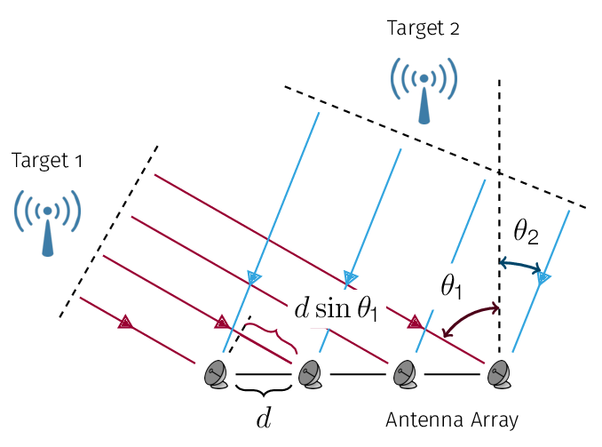

Angle of Arrival Estimation Toolbox (in Matlab)  
Author: Jet Yu    
Contact: jianyuan@vt.edu  
Time: May, 2019

# Introduction

# Problem Formation
Estimate Angle of arrive(AoA), or Direction of arrival(DoA) based on signals received at linear arrays.  

# Library

## Array Gemetory
* ULA
* UCA

## Methods
* Classic
  * Capon Beamform
  * MUSIC
  * ESPRIT
  * Pencil

* Machine Learning
  * ANN
  * CNN
  * RNN
  * kNN
  * SVM

# Files
fitEstQEBlock.m  
- generateData
  - Sig
    - myPulseShape
    - myAM
    - myPM
- VectorSensorSig
- myTrain
- myPlot 